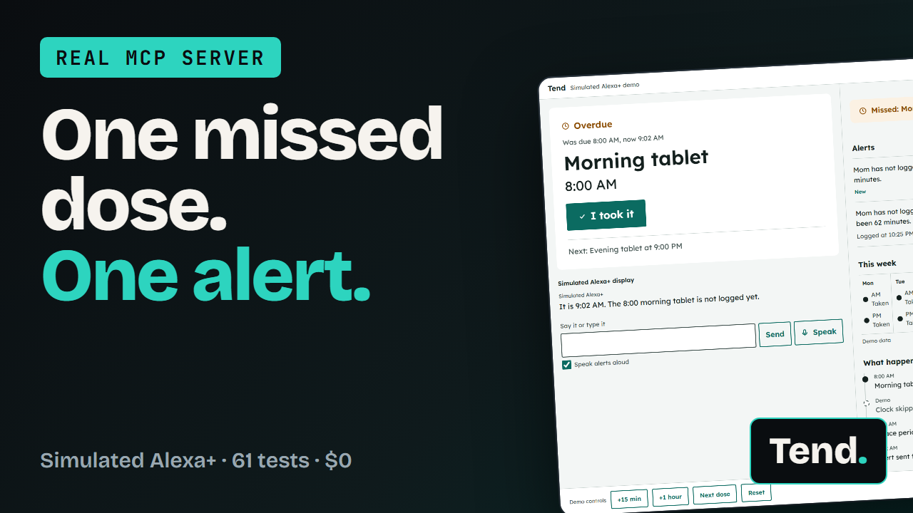
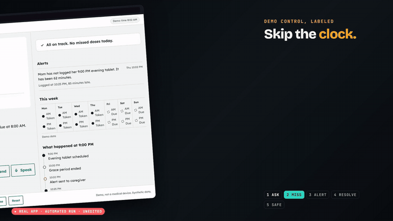
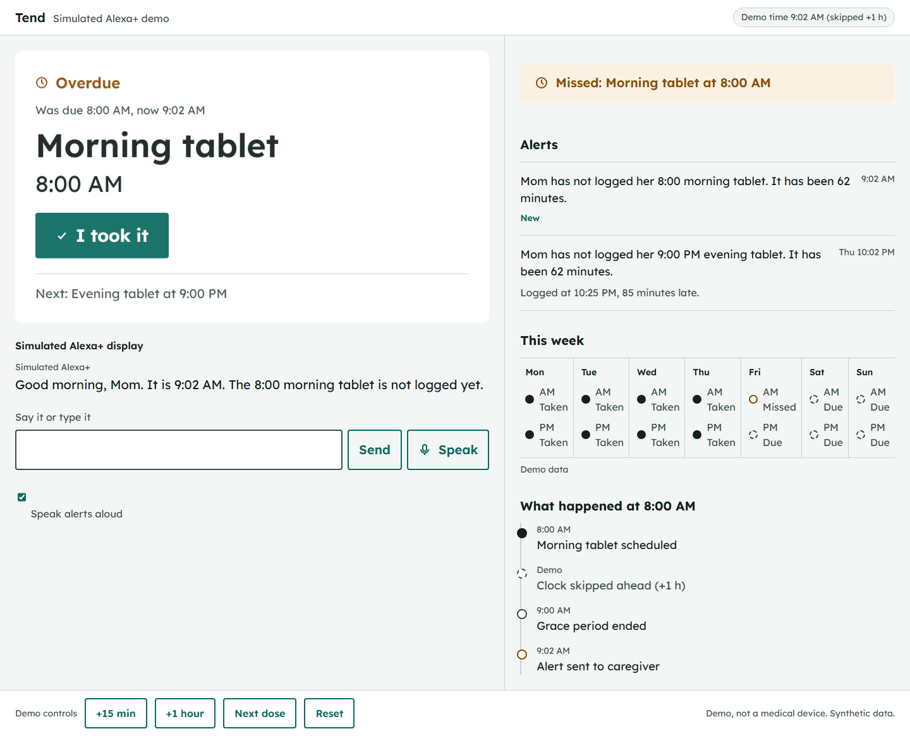
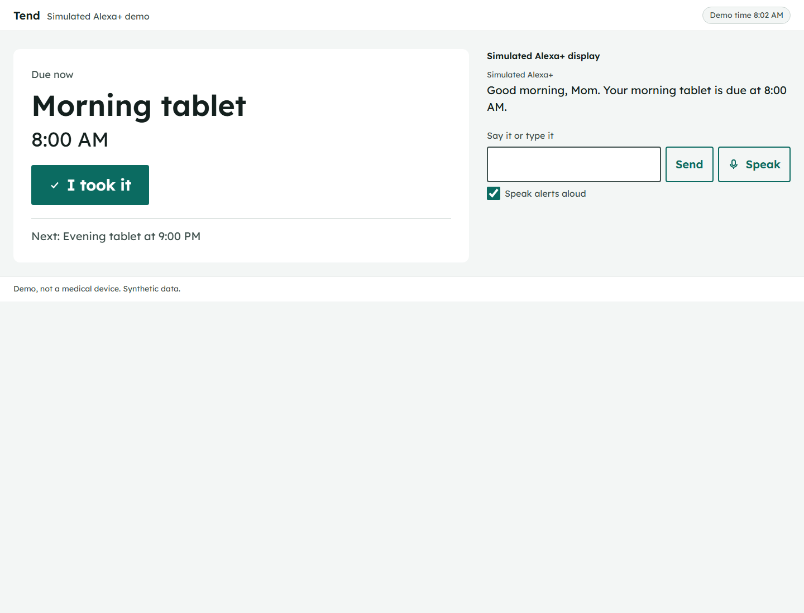
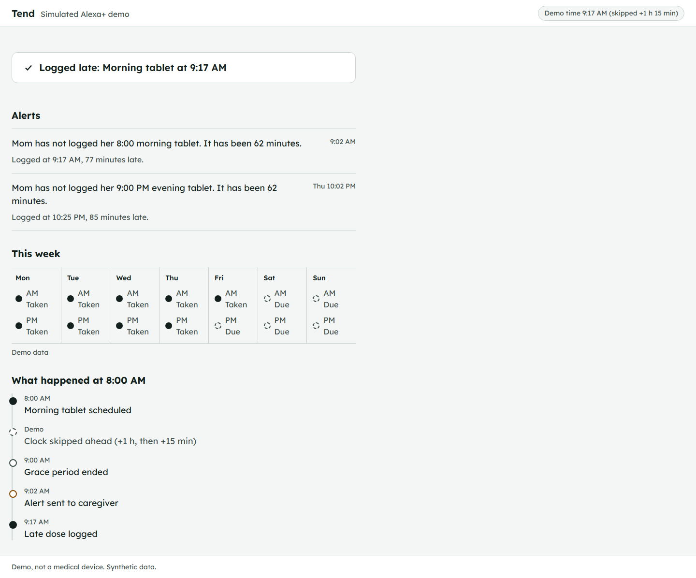
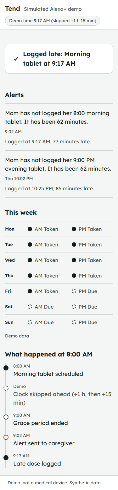

<div align="center">

# Tend

**A real MCP server for care coordination, with a simulated Alexa+ display.**<br>
One missed dose. One alert. Never two.

[](https://github.com/Guten-Morgen1302/tend-amazon/actions/workflows/ci.yml)


[](https://youtu.be/sSWEdtZ5-rM)

**[Watch the 2 minute demo](https://youtu.be/sSWEdtZ5-rM)** · Built for the Amazon Developer Hackathon 2026, Alexa+ track

</div>

---

## What it does

Tend keeps durable care state (schedules, doses, misses) behind eight MCP tools. When a dose is missed it queues **exactly one** alert for the caregiver, even if the check runs a hundred times from two processes. A late dose **resolves** the alert instead of sending another.

<div align="center">



</div>

> **What is real and what is simulated.** Live Alexa+ is not available to hackathon participants, so everything labeled "Simulated Alexa+" is a web app that stands in for it. The MCP server, its state, the miss rule, the idempotent escalation and the card contract are real and run without the simulator. The intent router and schedule parser are deterministic (regular expressions and templates), **not an AI**. Tend is **not a medical device**, never gives dosing advice, and ships only synthetic demo data. It costs $0 and needs no accounts or keys.

## Screens

<table>
  <tr>
    <td width="50%"></td>
    <td width="50%"></td>
  </tr>
  <tr>
    <td align="center"><b>Demo view</b>: the skipped clock turns the 8:00 dose overdue; the caregiver gets one alert</td>
    <td align="center"><b>Kitchen display</b>: one dose, one button, no clutter (simulated Alexa+)</td>
  </tr>
  <tr>
    <td></td>
    <td align="center"></td>
  </tr>
  <tr>
    <td align="center"><b>Caregiver</b>: the late dose resolves the alert with a follow-up line</td>
    <td align="center"><b>On a phone</b>: the week becomes a seven-row list below 420px</td>
  </tr>
</table>

## Quick start (about two minutes)

Requirements: Node.js 22.13 or newer (tested on 22 and 24). No accounts, no keys.

```bash
git clone https://github.com/Guten-Morgen1302/tend-amazon.git
cd tend-amazon
npm install
npm start
```

Open **http://127.0.0.1:3000/?view=demo**. The clock is frozen at Friday 08:02 so the demo is repeatable. Use the controls at the bottom:

1. Type "What's due?"
2. Press **+1 hour**. The morning dose turns overdue, one alert appears for the caregiver, and the timeline shows the skipped clock.
3. Press **+15 min**, then type "I took my morning pills". The alert gets a follow-up line and no second message is sent.
4. **Reset** returns to the start.

Routes: `?view=kitchen` (the older adult's display only), `?view=care` (the caregiver only), `?view=demo` (both).

Node prints an `ExperimentalWarning: SQLite` line. That is `node:sqlite`, which is built in and still marked experimental; it is harmless.

## How it works

```
 browser  --->  sim-host (:3000)  --- MCP client --->  tend-server (:3100/mcp)  --->  SQLite file
 (simulated      routes utterances,                      8 tools, stateless                (data/tend.db)
  Alexa+ UI)     serves the UI                           Streamable HTTP + JSON
   SIMULATED       SIMULATED                                  REAL                            REAL
```

- **tend-server** speaks MCP over Streamable HTTP, stateless, JSON responses, protocol version 2025-11-25 or later (whatever the installed SDK negotiates). Tool results carry `structuredContent` (a typed card) plus a text fallback.
- **sim-host** is a server-side MCP client. The browser never speaks MCP.
- **Eight tools:** `parse_schedule`, `set_schedule`, `log_dose`, `whats_due`, `check_misses`, `weekly_summary`, `list_notifications`, `snooze`.

### The card contract

Every tool returns a card: `ui` (`card` or `carousel`), a `layout` hint (`panel`, `list`, `week-strip`), `title`, `text`, `items`, `actions`, and optional `timeline` and `data`. It is defined once in Zod (`src/server/cards.ts`) and emitted to `schemas/card.schema.json`; a test fails if they drift. We do not know how real Alexa+ renders MCP results, so this contract is ours and the simulator is its reference renderer. It makes no claim about real Alexa+ rendering.

### Miss rule and escalation

A dose slot is missed when `now > due + 60 minutes` and nothing is logged. One snooze per slot extends the grace by 30 minutes. Slots are keyed by `(person, item, local date, local time)` and materialized once, so DST changes and later schedule edits cannot create duplicates. The escalation row has a unique key in SQLite, and `MISSED` plus the queued notification are written in one transaction. The grace window is configurable in code and set to 60 minutes here so the demo is easy to follow; real deployments would likely use a shorter window.

Escalation runs on call (`whats_due`, `log_dose`, `weekly_summary` and `check_misses` all check first) and the simulator polls every 30 seconds. There is no background scheduler, and delivery is a queued row shown in the simulator. There is no SMS or push.

### Safety

- Never gives medical advice. A guardrail checks every outgoing text (messages, spoken lines, card text, errors) against a word list in `src/server/guardrail.ts`. Medication names are user input: a name with a banned word is rejected when the schedule is saved. Tests check every template, the demo script and every mockup string against the guardrail.
- Binds to 127.0.0.1. Validates the `Host` and `Origin` headers. A non-loopback host refuses to start without `TEND_TOKEN`, and then requires `Authorization: Bearer ...`.
- Demo-only endpoints (`/admin/clock`, `/admin/reset`) exist only when `TEND_CLOCK=sim`, only on loopback, and are not MCP tools.
- Escaped rendering everywhere (`textContent`, never `innerHTML` with user text) and a strict Content-Security-Policy.
- Synthetic data only. Do not enter real patient data.

## Use the MCP server from any MCP client

```bash
npm run start:server          # tend-server only, http://127.0.0.1:3100/mcp
npx mcp-inspector --cli http://127.0.0.1:3100/mcp --transport http --method tools/list
```

`npm run conformance` starts a server on a free port and uses the MCP Inspector CLI to connect, list the eight tools and call each one. It is a connectivity and call check, not the full protocol suite.

## Engineering at a glance

| | |
|---|---|
| **61** | unit and integration tests: miss rule, DST, idempotency across **two OS processes**, guardrail, parser, MCP over HTTP, security, simulator host |
| **13** | Playwright browser tests: the demo script, routes, states, voice failure, accessibility, security headers |
| **4 / 4** | CI jobs green: Windows and Linux, Node 22.13 and 24 |
| **8** | MCP tools, one typed card contract |
| **$0** | no cloud, no keys, no accounts, no AI model |

## Develop

| Command | What it does |
|---|---|
| `npm test` | unit and integration tests |
| `npm run test:e2e` | Playwright: the demo script, routes, states, voice failure, accessibility, security headers |
| `npm run conformance` | Inspector CLI list and call check |
| `npm run typecheck` | TypeScript |
| `npm run schema` | Re-emit `schemas/card.schema.json` |
| `npm run seed` | Re-seed the synthetic demo data |
| `npm run screens` | Re-take the screenshots in `docs/screens/` |

First time with Playwright: `npx playwright install chromium`.

Configuration (all optional, see `.env.example`): `TEND_PORT`, `SIM_PORT`, `TEND_TZ` (IANA zone, default Asia/Kolkata), `TEND_CLOCK` (`sim` or `real`), `TEND_TOKEN`.

<details>
<summary><b>Troubleshooting</b></summary>

- **Port already in use:** set `TEND_PORT` / `SIM_PORT`, or stop the other process.
- **`node:sqlite` not found:** you need Node 22.13 or newer.
- **401 from the MCP endpoint:** you set `TEND_TOKEN`; send `Authorization: Bearer <token>`.
- **Voice does nothing:** the Web Speech API works in Chrome and Edge. Elsewhere the Speak button is hidden or shows "Voice didn't work here. Type it instead." Typing always works.
- **Inspector CLI hangs on Windows:** `npm run conformance` calls its launcher directly without a shell for this reason.

</details>

## Why it matters

About half of patients with chronic illness do not take their medications as prescribed (Brown and Bussell, "Medication adherence: WHO cares?", Mayo Clinic Proceedings 2011; 86(4):304-314, [PubMed 21389250](https://pubmed.ncbi.nlm.nih.gov/21389250/)). Families fill the gap with sticky notes and group chats. A voice assistant that already sits in the room could keep the state and tell the right person once, at the right time, without nagging. Tend is a small, honest slice of that idea: durable state, one alert per missed dose, and a typed card contract any client can render.

**Non-claims:** Tend is a hackathon prototype, not a medical product, has no clinical validation, and does not connect to a live Alexa+.

## Repo map

| Path | What |
|---|---|
| `src/server` | MCP server, core, guardrail, parser, templates |
| `src/sim` | simulator host and UI |
| `src/seed`, `schemas` | synthetic demo data, emitted card schema |
| `test`, `e2e` | unit and integration tests, browser tests |
| `docs` | plan, design, mockups, real screenshots, demo script, submission checklist |
| `video` | the Remotion project that builds the demo video |
| `DESIGN.md`, `FRICTION.md` | design system, friction log (seven real entries) |

## License

MIT, see `LICENSE`. Font notice in `THIRD_PARTY.md`.
